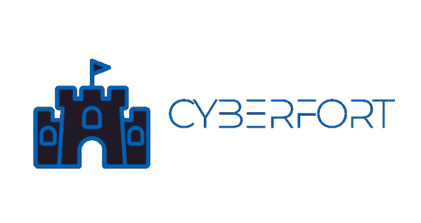

Cyberfort CTF is an online platform to test and advance skills in Penetration Testing and Cybersecurity. It is create

### Running the Project


#### Running Locally 
Cyberfort CTF is designed using the [Django framework](https://djangoproject.org). Building the project requires Pip and Python 3. It is recommended to install all the Python dependencies in a [virtual environment](https://pypi.org/project/virtualenv/). 

To get started, create a virtual environment - 

```bash

cyberfort@rocks:$ git clone https://github.com/chaitanyarahalkar/Cyberfort-CTF-Website
cyberfort@rocks:$ cd Cyberfort-CTF-Website
cyberfort@rocks:$ virtualenv venv
cyberfort@rocks:$ source venv/bin/activate 
cyberfort@rocks:$ pip install -r requirements.txt

```

Migrate the Django SQLite database before running the server. 

```bash

cyberfort@rocks:$ python manage.py migrate 
cyberfort@rocks:$ python manage.py runserver

```

#### Hosted Deployment 
One-click deploy on [Heroku](https://heroku.com)

[](https://heroku.com/deploy)


### Authors

 **Chaitanya Rahalkar**

* Twitter: [@chairahalkar](https://twitter.com/chairahalkar)
* Github: [@chaitanyarahalkar](https://github.com/chaitanyarahalkar)

 **Anushka Virgaonkar**

* Github: [@anushkavirgaonkar](https://github.com/anushkavirgaonkar)

#### Contributing

Contributions, issues and feature requests are welcome!<br />Feel free to check [issues page](https://github.com/chaitanyarahalkar/Cyberfort-CTF-Website/issues).

#### Show your support

Give a ⭐️ if this project helped you!

#### License

Copyright © 2019 [Chaitanya Rahalkar](https://github.com/chaitanyarahalkar).<br />
This project is [MIT](https://github.com/chaitanyarahalkar/Cyberfort-CTF-Website/blob/master/LICENSE) licensed.


